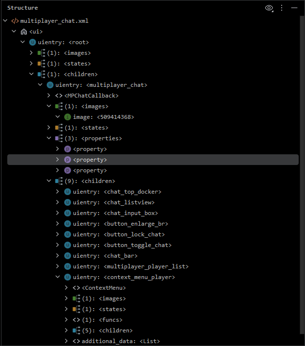
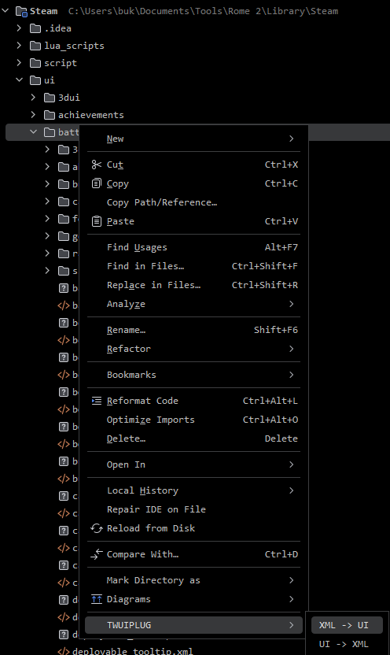
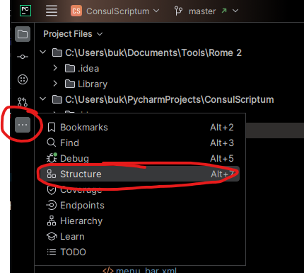
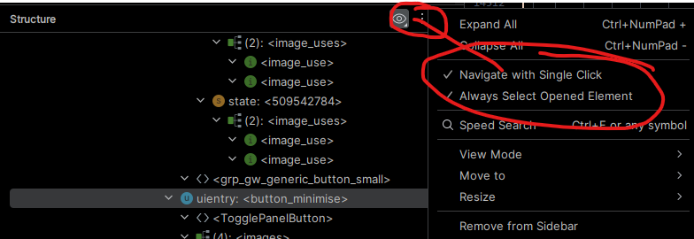
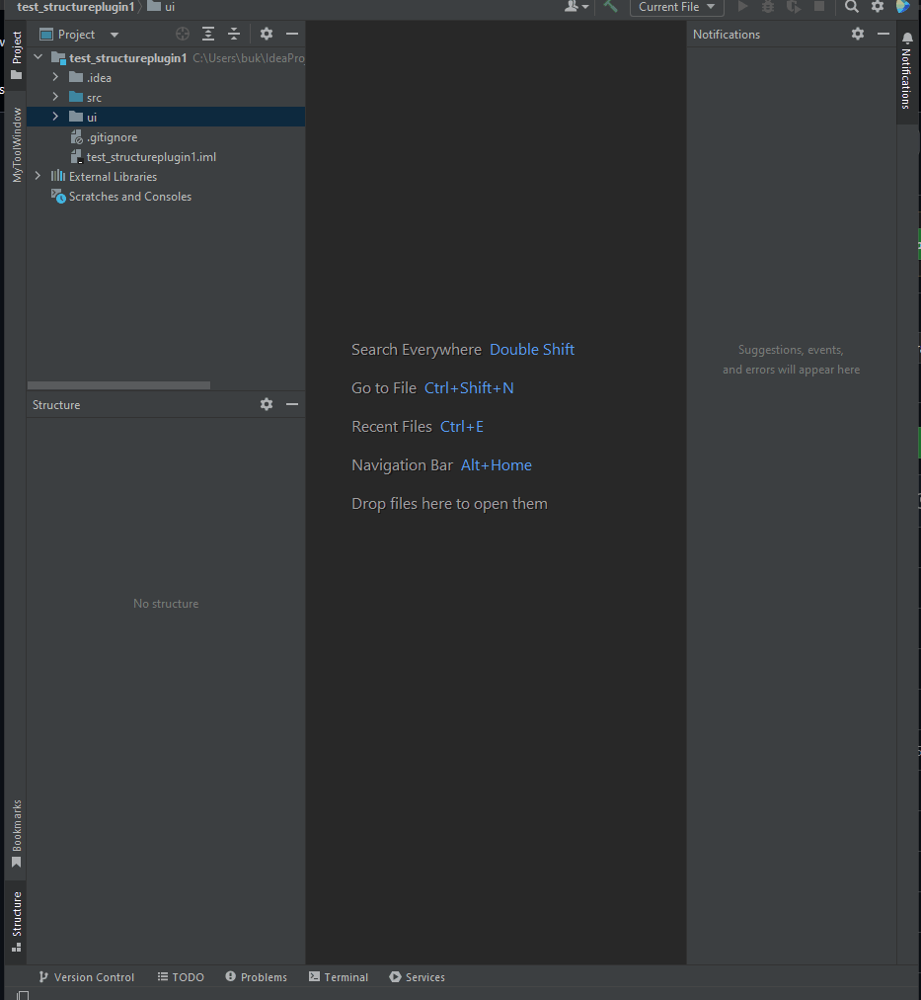

# twuiplug


[](https://plugins.jetbrains.com/plugin/26431)
[](https://plugins.jetbrains.com/plugin/26431)

<!-- Plugin description -->

Tool for modding (UI) in Total War games.
It's made to (hopefully) save you some time.

## Conversion XML <-> UI

Supported by >> [upstream `taw/etwng`](https://github.com/taw/etwng/tree/9a6afbb3fac230b734ae888bde230517ceaeb1a5/ui#supported-level-by-game):

- `Empire`: 204/205 (100%) - the only failing one is definitely corrupted
- `Napoleon`: 201/201 (100%)
- `Shogun 2`: 285/285 (100%)
- `Rome 2`: 306/306 (100%)
- `Attila`: 190/190 (100%)
- `Thrones of Britannia`: 205/205 (100%)
- `Warhammer 1`: 270/271 (100%)
- `Warhammer 2`: 348/349 (100%)
- `Troy`: 393/395 (99%)
- `Three Kingdoms`: 432/433 (100%)

## Structure View

### Note

Currently being improved for `Rome 2`. It may be a bit broken for other games.
If you use it with other games and the structure view is broken for you - create an issue on the [GitHub
repository](https://github.com/bukowa/twuiplug).



## Usage

1. Right-click on a file or directory (it will convert nested dirs):
  - 
2. Open built-in structure view:
  - 
3. Make sure to check these settings in structure view:
  - 

## Some old gif
  - 
<!-- Plugin description end -->

## Installation

- Using the IDE built-in plugin system:

  <kbd>Settings/Preferences</kbd> > <kbd>Plugins</kbd> > <kbd>Marketplace</kbd> > <kbd>Search for "twuiplug"</kbd> >
  <kbd>Install</kbd>

- Using JetBrains Marketplace:

  Go to [JetBrains Marketplace](https://plugins.jetbrains.com/plugin/26431) and install it by clicking
  the <kbd>Install to ...</kbd> button in case your IDE is running.

  You can also download the [latest release](https://plugins.jetbrains.com/plugin/26431/versions) from JetBrains
  Marketplace and install it manually using
  <kbd>Settings/Preferences</kbd> > <kbd>Plugins</kbd> > <kbd>⚙️</kbd> > <kbd>Install plugin from disk...</kbd>

- Manually:

  Download the [latest release](https://github.com/bukowa/twuiplug/releases/latest) and install it manually using
  <kbd>Settings/Preferences</kbd> > <kbd>Plugins</kbd> > <kbd>⚙️</kbd> > <kbd>Install plugin from disk...</kbd>

---
Plugin based on the [IntelliJ Platform Plugin Template][template].

[template]: https://github.com/JetBrains/intellij-platform-plugin-template

[docs:plugin-description]: https://plugins.jetbrains.com/docs/intellij/plugin-user-experience.html#plugin-description-and-presentation

```
com.intellij.openapi.actionSystem.AnAction:all
com.intellij.openapi.actionSystem.AnActionEvent:all
com.intellij.openapi.actionSystem.impl.Utils:all
```
