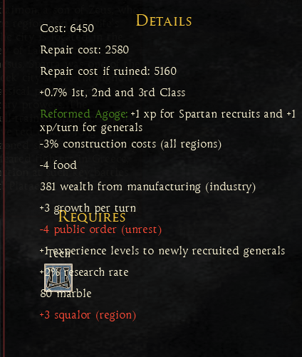
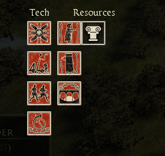
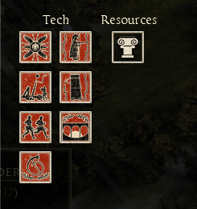
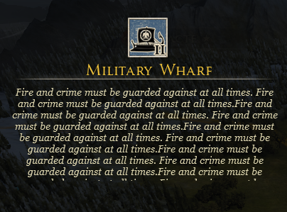
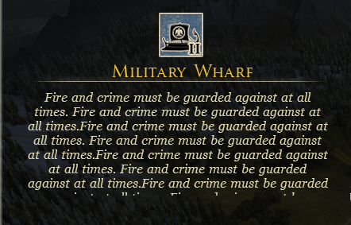

Take anything in this documentation as "probably":


- visible on/off
    ```
    <!-- uientry flag 8 -->
    ```

- movable on/off
    ```
    <!-- uientry flag 4 -->
    ```

- turn visibilty of state text on/off ? 
  
  this is required to be set to yes if you want to change state text otherwise its "dy"
  ```
  <!-- state stuff 4? -->
  ```

- sets(probably) interactivity of state
  ```
  <s>Default Font Category</s><!-- font category / twui -->
  <i>0</i><!-- left ? -->
  <i>0</i><!-- right ? -->
  <i>0</i><!-- top ? -->
  <i>0</i><!-- bottom ? -->
  <i>0</i>
  <yes />                      <<<<<<<<<<<<<<<<<<<<<<<<<<<<<< this one   
  ```

- some kind of size based behaviour based on children or parent?
  can make the element shorter or wider
  ```
  <no /><!-- uientry flag 1 -->
  ```

- when minimizing also minimizes all children?
  does not allow children to overflow parent?
  ```
  <no /><!-- uientry flag 9 -->
  ```

- makes parent resize to fit this component (if set to yes and 1)
  this for ex. I used in changing main menu campaign buttons for factions to fit
  ```
  <yes /><!-- uientry flag 2 -->
  <byte>1</byte><!-- uientry flag 3 -->
  ```
  flag 3 when set to 0 does not resize children below it 
  (see when 0 set on Details - Requires does not scale below) 

- `HorizontalList`
  ```
  <i>5</i><!-- mystery4 --> <<<<<<< number of rows
  ```
  ```
  <i>0</i><!-- mystery1 --> <<<<<< spacing in pixels between elements <right left>
  ```
  ```
  <i>0</i><!-- mystery2 --> <<<<<< spacing in pixels between elements <top bottom>
  ```
  ```
  <yes /><!-- mystery5 -->  <<<<<< another spacing, changed from < no to yes > see below
  ```
  
  

- `List`
  ```
  - <i>10</i><!-- mystery4 --> <<<<<<<<<< number of columns
  ```
- defines number of columns and their width
  ```
    <i>3</i><!-- count data points -->
    <flt>220.0</flt><!-- data point -->
    <flt>120.0</flt><!-- data point -->
    <flt>158.0</flt><!-- data point -->
  ```


- findings from `valerius` from dei discord channel
  ```
  the tags below font category are for padding
  the tags below state text and tooltip govern alignment and has to take spesific value combinations (i.e. 4-4-0-2 for justify center)
  entry flag 1 is horizontal resize
  entry flag 2 is vertical resize
  entry flag 9 is clip children
  you are probably correct about interactivity flag (for attila it is a bit more confusing, takes values like 256 and 257 for disabling)
  the boolean below ui entry 12 is localization related
  
  ```

- this when removed on encyclopedia building info adds strange glow around edges of the window
  *this is shader related flag*:
  ```
  <flt>10.0</flt><!-- margin top-bottom? -->
  <flt>10.0</flt><!-- margin left-right? -->
  ```

- resizes text to fit for ex:
  - 
    ```
    <no /><!-- uientry flag 1 -->
    <no /><!-- uientry flag 2 -->
    <byte>0</byte><!-- uientry flag 3 -->
    ```
  
  - 
    ```
    <no /><!-- uientry flag 1 -->
    <no /><!-- uientry flag 2 -->
    <byte>1</byte><!-- uientry flag 3 -->
    ```
